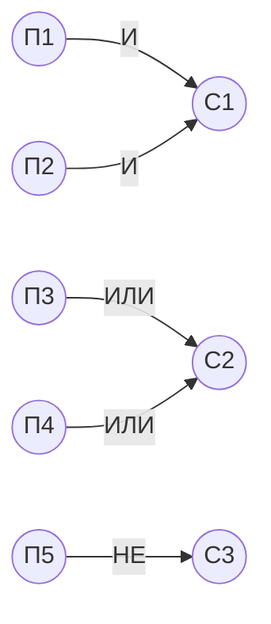

# Практическая работа №10. Тестирование методом чёрного ящика

## Цель работы

Отработать навыки тестирования программ методом «чёрного ящика».

## Теоретические сведения

### Тестирование чёрным ящиком

Цель тестирования **чёрным ящиком** — выяснить, в каких обстоятельствах поведение программы не соответствует **спецификации**.

Особенности метода:

- **известны** функции программы;
- **исследуется** работа каждой функции на всей области определения.

Это техника тестирования через **внешние интерфейсы** системы: функциональность продукта исследуется без анализа исходного кода. Тестировщики создают тест-кейсы на основе **требований спецификации** (технического задания). Проверяется правильность поведения программы при различных входных данных и внутреннем состоянии. Правильность определяется по спецификации или любым другим способом, кроме изучения кода.

Преимущества:

- позволяет находить дефекты в разработанной функциональности;
- тестировщику не нужна узкопрофильная специализация;
- проверка выполняется с позиции конечного пользователя;
- тест-кейсы можно разрабатывать сразу после завершения работы над спецификацией.

Методом чёрного ящика выполняются:

- функциональное тестирование;
- **регрессионное тестирование** — поиск ошибок в уже протестированных участках кода после внесения изменений;
- **юзабилити-тестирование** — проверка удобства и простоты использования;
- **дымовое тестирование** (smoke) — короткий цикл тестов после сборки: приложение запускается и выполняет основные функции, нет критических и блокирующих дефектов;
- проверка графического интерфейса пользователя.

### Исчерпывающее и разумное тестирование

Чтобы обнаружить все ошибки, нужно выполнить **исчерпывающее тестирование**, то есть тестирование на всех возможных наборах данных. Если выполнение команды зависит от предшествующих событий, нужно проверить и все возможные последовательности. Ожидаемый результат известен заранее, с ним сравнивается фактический.

Исчерпывающий входной тест в большинстве случаев построить невозможно. Поэтому выполняется **разумное тестирование** на небольшом подмножестве входных данных. Подмножество выбирается так, чтобы вероятность обнаружения ошибок была наивысшей.

### Тестирование сценариев использования

Тестирование сценариев использования (**use case**) — самый необходимый вид тестирования: программа должна выполнять операции, для которых предназначена. **Use case** — логически завершённая последовательность действий. Например, открытие файла в «Блокноте» — это use case, а выбор пункта меню «Открыть» — только первый шаг этого use case.

Если пользователь по сценарию выбирает пункт меню, а файл не открывается, это серьёзный дефект. Здесь проверяется правильность перехода программы между внутренними состояниями при выполнении операций, то есть при определённых входных данных.

### Методы формирования тестовых наборов

Стратегия чёрного ящика включает методы:

- эквивалентное разбиение;
- анализ граничных значений;
- анализ причинно-следственных связей (метод функциональных диаграмм);
- предположение об ошибке.

### Эквивалентное разбиение

Пример: программа отдела кадров автопредприятия, поле «Возраст соискателя». Требования:

| Возраст | Решение |
| --- | --- |
| 0–13 лет | не нанимать |
| 14–17 лет | можно нанимать на неполный день |
| 18–54 года | можно нанимать на полный день |
| 55–99 лет | не нанимать |

Чтобы проверить все разрешённые данные, нужно ввести числа от 0 до 99. Возможен также ввод отрицательных чисел и нечисловых данных. Проверять все числа от 0 до 99 не нужно, если реализация такая:

```js
if (age >= 0 && age <= 13) hireStatus = 'NO';
if (age >= 14 && age <= 17) hireStatus = 'PART';
if (age >= 18 && age <= 54) hireStatus = 'FULL';
if (age >= 55 && age <= 99) hireStatus = 'NO';
```

А если ввести 100? Подумайте, где могла быть выявлена такая ошибка.

Достаточно проверить по одному числу из каждого диапазона (5, 15, 20, 60) и граничные значения, то есть первое и последнее значение каждого диапазона: 0, 13, 14, 17, 18, 54, 55, 99.

Основу метода составляют два положения:

1. Исходные данные разбиваются на конечное число **классов эквивалентности** так, чтобы любой тест-представитель класса был эквивалентен любому другому тесту этого класса. Если тест класса обнаруживает ошибку, предполагается, что все тесты этого класса обнаружат её, и наоборот.
2. Каждый тест должен включать как можно больше различных входных условий. Это минимизирует общее число тестов.

Первое положение используется для поиска «интересных» условий, которые нужно протестировать, второе — для построения минимального набора тестов.

Разработка тестов методом эквивалентного разбиения выполняется в два этапа:

1. Выделение классов эквивалентности.
2. Построение тестов.

Классы эквивалентности выделяются так: каждое входное условие (обычно предложение или фраза из спецификации) разбивается на две или более групп. Используется таблица:

| Входное условие | Правильные классы эквивалентности | Неправильные классы эквивалентности |
| --- | --- | --- |
| | | |

Метод классов эквивалентности делится на три этапа:

1. Тестирование разрешённых значений.
2. Тестирование граничных значений.
3. Тестирование запрещённых значений.

Выделение классов эквивалентности — эвристический процесс, но для него есть правила:

- Если входное условие описывает **область значений** (например, «целое число от 1 до 999»), выделяют один правильный класс 1 ≤ X ≤ 999 и два неправильных: X < 1 и X > 999.
- Если входное условие описывает **число значений** (например, «в автомобиле едут от одного до шести человек»), выделяют один правильный класс и два неправильных: ни одного человека и более шести.
- Если входное условие описывает **множество входных значений** и есть основания полагать, что программа обрабатывает каждое значение особо (например, «способы передвижения: АВТОБУС, ГРУЗОВИК, ТАКСИ, МОТОЦИКЛ, ПЕШКОМ»), выделяют правильный класс для каждого значения и один неправильный класс (например, «ПРИЦЕП»).
- Если входное условие описывает ситуацию **«должно быть»** (например, «первый символ идентификатора должен быть буквой»), выделяют один правильный класс (первый символ — буква) и один неправильный (первый символ — не буква).
- Если есть основание считать, что **различные элементы** класса обрабатываются программой неодинаково, класс разбивается на меньшие классы.

**Запрещённые данные** тестируются аналогично. Например, можно выделить классы «дробное число от 0 до 99», «отрицательное число», «число больше 99», «набор букв», «пустая строка». Тесты для неправильных классов нужны, потому что одни проверки ошибочных входов могут скрывать или заменять другие.

### Попарное тестирование

Недостаток метода эквивалентного разбиения — он не исследует комбинации входных условий и не учитывает взаимное влияние параметров, о котором пользователь не знает (например, дефект интерфейса, если интерфейс интуитивно непонятен). При взаимном влиянии чаще всего встречаются дефекты, возникающие при определённом сочетании двух параметров.

Поэтому проверяют все возможные значения для каждой пары параметров. Такой подход называется **попарным тестированием**. В нём используется двумерный массив, в котором любые две колонки содержат все возможные комбинации (пары) значений. Полный перебор всех комбинаций неприемлем из-за большого времени выполнения.

### Анализ граничных значений

**Граничные условия** — ситуации на границах входных классов эквивалентности, выше и ниже них. Анализ граничных значений отличается от эквивалентного разбиения:

- представитель класса выбирается так, чтобы тестом проверялась каждая граница класса;
- при разработке тестов рассматриваются не только входные условия (**пространство входов**), но и **пространство результатов**.

Общие правила метода:

- Если входное условие описывает область значений, постройте тесты для границ области и тесты с неправильными данными для незначительного выхода за границы. Например, для области от −1.0 до +1.0 нужны тесты −1.0, +1.0, −1.001 и +1.001.
- Если входное условие описывает дискретный ряд значений, постройте тесты для минимального и максимального значений и для значений меньше и больше них. Например, если входной файл содержит от 1 до 255 записей, проверьте 0, 1, 255 и 256 записей.
- Если вход или выход программы — упорядоченное множество (последовательный файл, линейный список, таблица), сосредоточьтесь на первом и последнем элементах.

Анализ граничных условий — один из самых полезных методов проектирования тестов. Его недостатки:

- граничные условия бывают едва уловимы, определить их трудно;
- метод не позволяет проверять различные сочетания исходных данных.

### Анализ причинно-следственных связей

**Метод анализа причинно-следственных связей** (метод функциональных диаграмм) помогает системно выбирать высокорезультативные тесты. Побочный эффект метода — обнаружение неполноты и неоднозначности спецификации.

Для метода нужно понимание **булевой логики**: операторов И, ИЛИ, НЕ. Связи между причинами и следствиями изображаются в виде графа, где узлы — причины и следствия, а логические функции обозначаются подписями на рёбрах:



Тесты строятся в несколько этапов:

1. **Спецификация разбивается на участки**, потому что таблицы причинно-следственных связей для больших спецификаций становятся громоздкими. Например, при тестировании компилятора рабочим участком может быть отдельный оператор языка.
2. В спецификации определяются **множество причин** и **множество следствий**. **Причина** — отдельное входное условие или класс эквивалентности входных условий. **Следствие** — выходное условие или преобразование системы. Каждой причине и каждому следствию присваивается номер.
3. По спецификации строится **таблица истинности**: перебираются все комбинации причин и для каждой определяются следствия. Таблица снабжается примечаниями об ограничениях и о комбинациях, которые невозможны из-за синтаксических или внешних ограничений. При необходимости аналогичная таблица строится для класса эквивалентности. Истина обозначается «1», ложь — «0», безразличное состояние условия (0 или 1) — «X».
4. Каждая строка таблицы истинности преобразуется в тест. Тесты из независимых таблиц по возможности совмещаются.

### Предположение об ошибке

Опытный тестировщик часто находит ошибки «без всяких методов», подсознательно применяя метод **предположения об ошибке**. Метод основан на интуиции: составляется список возможных ошибок или ситуаций, в которых они могут появиться, и по этому списку строятся тесты. Иначе говоря, перечисляются специальные случаи, которые могли быть не учтены при проектировании.

Например, для подпрограммы сортировки нужно исследовать ситуации:

- сортируемый список пуст;
- список содержит одно значение;
- все записи списка имеют одинаковое значение;
- список уже отсортирован.

### Нисходящее и восходящее тестирование

**Нисходящее тестирование** начинается с верхнего, головного класса (модуля) программы. Следующим для тестирования выбирается класс, методы которого вызываются классом, уже прошедшим тестирование.

**Восходящее тестирование** начинается с терминальных классов, то есть классов, которые не используют методы других классов. Следующим выбирается класс, методы которого используют уже протестированные классы.

### Общая стратегия тестирования

Каждый метод даёт набор тестов, но ни один не даёт полного набора. Поэтому методы объединяются в общую стратегию:

1. Если спецификация содержит комбинации входных условий, начните с метода функциональных диаграмм (причинно-следственных связей).
2. В любом случае используйте анализ граничных значений.
3. Определите правильные и неправильные классы эквивалентности для входных и выходных данных и при необходимости дополните тесты, построенные на предыдущих шагах.
4. Для получения дополнительных тестов используйте метод предположения об ошибке.

## Задания

В отчёте покажите использование нескольких методов чёрного ящика.

### Задание 1. Подготовка тестов

Ознакомьтесь с теоретическими сведениями по стратегиям тестирования. По варианту задачи (раздел «Варианты») подготовьте тесты методами стратегии **чёрного ящика**:

1. Определите причины (условия ввода) и следствия.
2. Постройте граф причинно-следственных связей.
3. Постройте тестовые варианты.

### Задание 2. Разработка программы и тестирование

1. Разработайте программу по варианту.
2. Выполните тестирование.
3. Занесите тесты и результаты в таблицу тестирования:

| Номер теста | Назначение теста | Значения исходных данных | Ожидаемый результат | Реакция программы | Вывод |
| --- | --- | --- | --- | --- | --- |
| 1 | | | | | |
| 2 | | | | | |
| 3 | | | | | |

4. Оформите результаты тестирования.
5. Сделайте вывод о роли тестирования по стратегии чёрного ящика и возможностях его применения. Сформулируйте достоинства и недостатки стратегии.

### Задание 3. Отчёт

Отчёт по работе должен включать:

- краткое описание работы;
- задание;
- перечень причин и следствий;
- граф причинно-следственных связей;
- таблицу решений;
- тестовые варианты;
- результаты тестирования.

## Варианты

Можно выбрать любые несколько вариантов или предложить свои. Условие — самостоятельное выполнение, одинаковых решений быть не должно. Оценка зависит от количества выполненных вариантов.

### Вариант 1

Разработать программу расчёта стоимости парковки. Спецификация:

- время стоянки задаётся целым числом минут от 0 до 1440;
- стоянка до 15 минут включительно бесплатна;
- иначе оплачивается каждый начатый час по 100 ₽: например, 16 минут и 60 минут стоят 100 ₽, 61 минута — 200 ₽;
- стоимость не превышает 800 ₽;
- при неверном вводе программа выводит сообщение об ошибке.

### Вариант 2

Разработать программу проверки входа в личный кабинет. Список пользователей с паролями задаётся в программе. Спецификация:

- если логин или пароль не введены, программа выводит «Заполните все поля», попытка не засчитывается;
- если логин и пароль верны, программа выводит «Вход выполнен», счётчик неудачных попыток этого пользователя сбрасывается;
- если логин не существует или пароль неверен, программа выводит «Неверный логин или пароль»;
- после трёх неудачных попыток подряд для существующего логина программа выводит «Аккаунт заблокирован», и дальнейшие попытки входа в этот аккаунт, в том числе с верным паролем, отклоняются с тем же сообщением;
- логин не чувствителен к регистру, пробелы в начале и в конце логина игнорируются; пароль чувствителен к регистру.

### Вариант 3

Разработать программу определения вида треугольника, заданного длинами сторон: равносторонний, равнобедренный, прямоугольный, разносторонний.

### Вариант 4

Разработать программу применения промокода в интернет-магазине. Программа получает промокод, сумму заказа и признак первого заказа покупателя и выводит сообщение и сумму к оплате. Спецификация:

- промокод SALE10 даёт скидку 10 % при сумме заказа от 1000 ₽;
- промокод MINUS500 даёт скидку 500 ₽ при сумме заказа от 3000 ₽ и действует только на первый заказ покупателя;
- промокод вводится без учёта регистра, пробелы в начале и в конце игнорируются;
- если промокода нет в списке, программа выводит «Промокод не найден»;
- если сумма меньше минимальной, программа выводит «Минимальная сумма заказа N ₽», где N — минимальная сумма для этого промокода;
- если MINUS500 вводится не для первого заказа, программа выводит «Промокод действует только на первый заказ»;
- если промокод не применён, сумма к оплате равна сумме заказа;
- сумма заказа — положительное число.

## Примеры

В примерах используются JavaScript, Node.js и **Jest**. Установка Jest описана в практической работе №5.

### Пример 1. Возраст соискателя

#### А. Исходная реализация

Реализация из раздела «Теоретические сведения». Сохраните код в файл `hire.js`.

```js
function getHireStatus(age) {
  let hireStatus;
  if (age >= 0 && age <= 13) hireStatus = 'NO';
  if (age >= 14 && age <= 17) hireStatus = 'PART';
  if (age >= 18 && age <= 54) hireStatus = 'FULL';
  if (age >= 55 && age <= 99) hireStatus = 'NO';
  return hireStatus;
}

module.exports = { getHireStatus };
```

#### Б. Классы эквивалентности

| Входное условие | Правильные классы эквивалентности | Неправильные классы эквивалентности |
| --- | --- | --- |
| Возраст — целое число от 0 до 99 | 0–13, 14–17, 18–54, 55–99 | меньше 0, больше 99, дробное число, набор букв, пустая строка |

#### В. Тесты

Тесты строятся по спецификации, без анализа кода: представитель и границы каждого правильного класса, по одному представителю каждого неправильного класса. Спецификация не говорит, как программа реагирует на неправильный ввод. Примем, что она выбрасывает исключение: `RangeError` для числа вне диапазона и `TypeError` для нецелого значения (см. практическую работу №8). Сохраните код в файл `hire.test.js`.

```js
const { getHireStatus } = require('./hire');

describe('разрешённые значения и границы', () => {
  test.each([
    [0, 'NO'], [5, 'NO'], [13, 'NO'],
    [14, 'PART'], [15, 'PART'], [17, 'PART'],
    [18, 'FULL'], [20, 'FULL'], [54, 'FULL'],
    [55, 'NO'], [60, 'NO'], [99, 'NO'],
  ])('возраст %p: %s', (age, expected) => {
    expect(getHireStatus(age)).toBe(expected);
  });
});

describe('запрещённые значения', () => {
  test.each([
    [-1, RangeError],
    [100, RangeError],
    [15.5, TypeError],
    ['abc', TypeError],
    ['', TypeError],
  ])('возраст %p: ошибка', (age, errorType) => {
    expect(() => getHireStatus(age)).toThrow(errorType);
  });
});
```

#### Г. Результат для исходной реализации

```bash
npx jest hire.test.js --verbose
```

Список тестов и итог (подробные сообщения об ошибках опущены):

```text
FAIL ./hire.test.js
  разрешённые значения и границы
    ✓ возраст 0: NO
    ✓ возраст 5: NO
    ✓ возраст 13: NO
    ✓ возраст 14: PART
    ✓ возраст 15: PART
    ✓ возраст 17: PART
    ✓ возраст 18: FULL
    ✓ возраст 20: FULL
    ✓ возраст 54: FULL
    ✓ возраст 55: NO
    ✓ возраст 60: NO
    ✓ возраст 99: NO
  запрещённые значения
    ✕ возраст -1: ошибка
    ✕ возраст 100: ошибка
    ✕ возраст 15.5: ошибка
    ✕ возраст "abc": ошибка
    ✕ возраст "": ошибка

Tests:       5 failed, 12 passed, 17 total
```

Тесты правильных классов и границ проходят, все тесты неправильных классов падают. Фактическая реакция исходной реализации на неправильный ввод:

| Значение | Реакция программы | Вывод |
| --- | --- | --- |
| −1 | `undefined` | Ошибка: нет сообщения о неверном вводе |
| 100 | `undefined` | Ошибка: нет сообщения о неверном вводе |
| 15.5 | `'PART'` | Ошибка: дробный возраст принят как допустимый |
| `'abc'` | `undefined` | Ошибка: нет сообщения о неверном вводе |
| `''` | `'NO'` | Ошибка: пустая строка преобразована в 0 и принята как допустимый возраст |

Последний дефект найден тестом класса «пустая строка», которого нет среди правильных классов. Это пример того, зачем строить тесты для неправильных классов.

#### Д. Исправленная реализация

```js
function getHireStatus(age) {
  if (!Number.isInteger(age)) {
    throw new TypeError(`Возраст должен быть целым числом, получено: ${age}`);
  }
  if (age < 0 || age > 99) {
    throw new RangeError(`Возраст вне диапазона 0..99: ${age}`);
  }
  if (age <= 13) return 'NO';
  if (age <= 17) return 'PART';
  if (age <= 54) return 'FULL';
  return 'NO';
}

module.exports = { getHireStatus };
```

```text
Tests:       17 passed, 17 total
```

### Пример 2. Точка пересечения двух прямых

#### А. Спецификация

Программа определяет точку пересечения двух прямых на плоскости и попутно определяет, параллельна ли прямая одной из осей координат. В основе программы — решение системы линейных уравнений:

```text
Ax + By = C
Dx + Ey = F
```

#### Б. Проектирование тестов

**Метод эквивалентных разбиений.** Для всех коэффициентов один правильный класс (коэффициент — вещественное число) и один неправильный (коэффициент — не вещественное число). Получаем 7 тестов:

- все коэффициенты — вещественные числа (тест 1);
- поочерёдно каждый из коэффициентов — не вещественное число (тесты 2–7).

**Метод граничных условий.** Для исходных данных граничных условий нет: коэффициенты — любые вещественные числа. Для результатов возможны три варианта: единственное решение, множество решений (прямые совпадают), отсутствие решений (прямые параллельны). Тесты с результатами внутри области:

- результат — единственное решение;
- результат — множество решений;
- результат — отсутствие решений.

Тесты с результатами на границе (Δ — определитель системы, Δ = AE − BD):

1. Δ = 0,01.
2. Δ = −0,01.
3. Точка пересечения x = 0,01, y = 0.
4. Точка пересечения x = 0, y = −0,01.

**Метод анализа причинно-следственных связей.** Определяем множество условий:

- для определения типа и существования первой прямой;
- для определения типа и существования второй прямой;
- для определения точки пересечения.

По этим трём группам причинно-следственных связей строятся таблицы истинности. Каждая строка таблиц преобразуется в тест, при этом берутся данные, соответствующие строкам сразу двух или всех трёх таблиц. К имеющимся тестам добавляются:

- проверки всех случаев расположения обеих прямых: 6 тестов по первой прямой вкладываются в 6 тестов по второй прямой так, чтобы варианты не совпадали;
- отдельная проверка несовпадения условия x = 0 или y = 0 (в зависимости от теста, выбранного по методу граничных условий); её можно совместить с предыдущими 6 тестами.

**Метод предположения об ошибке.** Добавляем тест: все коэффициенты равны нулю.

Всего по четырём методам получено 20 тестов. Если вложить независимые проверки друг в друга, число тестов можно сократить. Для каждого теста укажите результат в таблице тестирования.

#### В. Реализация

Сохраните код в файл `lines.js`. Функция возвращает тип каждой прямой и результат.

```js
function describeLine(a, b) {
  if (a === 0 && b === 0) return 'не прямая';
  if (a === 0) return 'параллельна OX';
  if (b === 0) return 'параллельна OY';
  return 'общего вида';
}

// Прямые: a*x + b*y = c и d*x + e*y = f
function intersect(a, b, c, d, e, f) {
  for (const value of [a, b, c, d, e, f]) {
    if (typeof value !== 'number' || !Number.isFinite(value)) {
      throw new TypeError(`Коэффициент не является вещественным числом: ${value}`);
    }
  }
  const line1 = describeLine(a, b);
  const line2 = describeLine(d, e);
  if (line1 === 'не прямая' || line2 === 'не прямая') {
    return { line1, line2, result: 'нет решения: уравнение не задаёт прямую' };
  }
  const delta = a * e - b * d;
  const deltaX = c * e - b * f;
  const deltaY = a * f - c * d;
  if (delta === 0) {
    const result = deltaX === 0 && deltaY === 0 ? 'прямые совпадают' : 'прямые параллельны';
    return { line1, line2, result };
  }
  return { line1, line2, result: 'одна точка', x: deltaX / delta, y: deltaY / delta };
}

module.exports = { intersect };
```

#### Г. Таблица тестирования

Фрагмент таблицы: по несколько тестов на каждый метод.

| Номер теста | Назначение теста | Значения исходных данных (A, B, C, D, E, F) | Ожидаемый результат | Реакция программы | Вывод |
| --- | --- | --- | --- | --- | --- |
| 1 | Все коэффициенты вещественные | 1, 1, 2, 1, −1, 0 | Точка (1; 1) | Точка (1; 1) | Ошибки не найдены |
| 2 | Коэффициент A не число | abc, 1, 2, 1, −1, 0 | Сообщение об ошибке | `TypeError` | Ошибки не найдены |
| 3 | Прямые совпадают | 1, 1, 2, 2, 2, 4 | Множество решений | «прямые совпадают» | Ошибки не найдены |
| 4 | Прямые параллельны | 1, 1, 2, 1, 1, 3 | Нет решений | «прямые параллельны» | Ошибки не найдены |
| 5 | Δ = 0,01 | 1, 1, 2, 1, 1.01, 3 | Точка (−98; 100) | Точка (−97.99999999999991; 99.99999999999991) | Погрешность вычислений с плавающей точкой, сравнивать с допуском |
| 6 | Δ = −0,01 | 1, 1, 2, 1, 0.99, 3 | Точка (102; −100) | Точка (101.99999999999991; −99.99999999999991) | Погрешность вычислений с плавающей точкой, сравнивать с допуском |
| 7 | Точка на границе x = 0,01, y = 0 | 1, 1, 0.01, 1, −1, 0.01 | Точка (0,01; 0) | Точка (0.01; 0) | Ошибки не найдены |
| 8 | Первая прямая параллельна OX, вторая параллельна OY | 0, 1, 2, 1, 0, 3 | Точка (3; 2) | Точка (3; 2) | Ошибки не найдены |
| 9 | Все коэффициенты равны нулю | 0, 0, 0, 0, 0, 0 | Сообщение «уравнение не задаёт прямую» | «нет решения: уравнение не задаёт прямую» | Ошибки не найдены |

#### Д. Автоматические тесты

Сохраните код в файл `lines.test.js`. Для результатов с плавающей точкой используется матчер `toBeCloseTo`: при сравнении через `toBe` тест 5 упадёт с сообщением `Expected: -98, Received: -97.99999999999991`.

```js
const { intersect } = require('./lines');

describe('эквивалентное разбиение', () => {
  test('все коэффициенты вещественные', () => {
    expect(intersect(1, 1, 2, 1, -1, 0)).toMatchObject({ result: 'одна точка', x: 1, y: 1 });
  });

  test.each([['A', 0], ['B', 1], ['C', 2], ['D', 3], ['E', 4], ['F', 5]])('коэффициент %s не число', (name, index) => {
    const coefficients = [1, 1, 2, 1, -1, 0];
    coefficients[index] = 'abc';
    expect(() => intersect(...coefficients)).toThrow(TypeError);
  });
});

describe('граничные значения результата', () => {
  test('прямые совпадают', () => {
    expect(intersect(1, 1, 2, 2, 2, 4).result).toBe('прямые совпадают');
  });

  test('прямые параллельны', () => {
    expect(intersect(1, 1, 2, 1, 1, 3).result).toBe('прямые параллельны');
  });

  test('определитель равен 0,01', () => {
    const point = intersect(1, 1, 2, 1, 1.01, 3);
    expect(point.x).toBeCloseTo(-98);
    expect(point.y).toBeCloseTo(100);
  });

  test('определитель равен -0,01', () => {
    const point = intersect(1, 1, 2, 1, 0.99, 3);
    expect(point.x).toBeCloseTo(102);
    expect(point.y).toBeCloseTo(-100);
  });
});

describe('причинно-следственные связи', () => {
  test('первая прямая параллельна OX, вторая параллельна OY', () => {
    expect(intersect(0, 1, 2, 1, 0, 3)).toMatchObject({
      line1: 'параллельна OX', line2: 'параллельна OY', x: 3, y: 2,
    });
  });
});

describe('предположение об ошибке', () => {
  test('все коэффициенты равны нулю', () => {
    expect(intersect(0, 0, 0, 0, 0, 0).result).toBe('нет решения: уравнение не задаёт прямую');
  });
});
```

```bash
npx jest lines.test.js --verbose
```

```text
PASS ./lines.test.js
  эквивалентное разбиение
    ✓ все коэффициенты вещественные
    ✓ коэффициент A не число
    ✓ коэффициент B не число
    ✓ коэффициент C не число
    ✓ коэффициент D не число
    ✓ коэффициент E не число
    ✓ коэффициент F не число
  граничные значения результата
    ✓ прямые совпадают
    ✓ прямые параллельны
    ✓ определитель равен 0,01
    ✓ определитель равен -0,01
  причинно-следственные связи
    ✓ первая прямая параллельна OX, вторая параллельна OY
  предположение об ошибке
    ✓ все коэффициенты равны нулю

Tests:       13 passed, 13 total
```

#### Е. Для самопроверки

Для контроля понимания проработайте программы, определяющие точку пересечения двух прямых на плоскости: https://www.interestprograms.ru/source-codes-tochka-peresecheniya-dvuh-pryamyh-na-ploskosti

## Контрольные вопросы

1. Чем тестирование чёрным ящиком отличается от тестирования белым ящиком?
2. Почему исчерпывающее тестирование в большинстве случаев невозможно и как выбирается подмножество тестов?
3. Как выделяются правильные и неправильные классы эквивалентности?
4. Чем анализ граничных значений отличается от эквивалентного разбиения?
5. Из каких этапов состоит построение тестов методом анализа причинно-следственных связей?
6. В каких случаях применяется метод предположения об ошибке?

## Вывод

Сделайте вывод по работе.

## Источники

- Jest. Начало работы: https://jestjs.io/docs/getting-started
- Jest. test.each: https://jestjs.io/docs/api#testeachtablename-fn-timeout
- Jest. Справочник по `expect`: https://jestjs.io/docs/expect
- MDN. Number.isInteger: https://developer.mozilla.org/ru/docs/Web/JavaScript/Reference/Global_Objects/Number/isInteger
- Mermaid. Блок-схемы: https://mermaid.js.org/syntax/flowchart.html