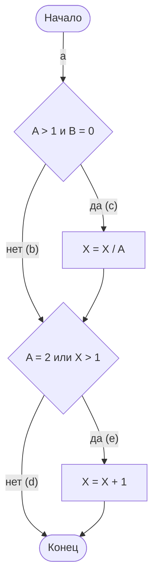
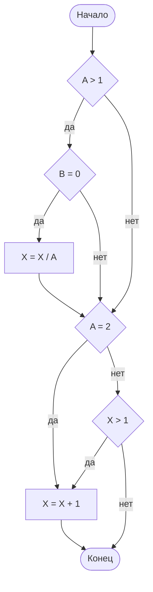
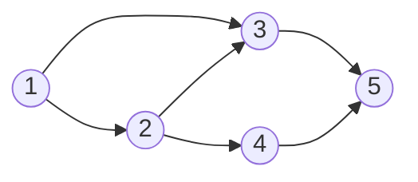

# Практическая работа №9. Тестирование методом белого ящика

## Цель работы

Изучить методы тестирования логики программы, научиться формализовать описание результатов тестирования и составлять схемы алгоритмов. Закрепить навыки тестирования методами белого ящика.

## Теоретические сведения

### Структурное тестирование

Тестирование ПО включает действия, аналогичные процессам разработки:

1. Постановка задачи для теста.
2. Проектирование теста.
3. Написание тестов.
4. Тестирование тестов.
5. Выполнение тестов.
6. Изучение результатов тестирования.

Решающую роль играет **проектирование тестов**. Подход **белого ящика** (структурный подход) основан на анализе логики программы: проверяется каждый путь и каждая ветвь алгоритма, внешняя спецификация во внимание не принимается. Качество тестирования белым ящиком характеризуется степенью, с которой тесты выполняют (покрывают) логику программы, то есть её исходный текст.

В таблицах этой работы тест считается **успешным**, если он обнаружил ошибку (фактический результат не совпал с ожидаемым), и **неуспешным**, если ошибка не найдена.

### Пример алгоритма

Методы ниже рассматриваются на одном алгоритме. Рёбра графа обозначены буквами: `a` — вход, `b` и `c` — ветви первого решения, `d` и `e` — ветви второго решения. Путь записывается последовательностью букв, например `ace`.



Тот же алгоритм на JavaScript:

```js
function calculate(a, b, x) {
  if (a > 1 && b === 0) {
    x = x / a;
  }
  if (a === 2 || x > 1) {
    x = x + 1;
  }
  return x;
}
```

### Метод покрытия операторов

Цель **метода покрытия операторов** — выполнить каждый оператор программы хотя бы один раз. Для алгоритма выше достаточно одного теста, который проходит путь `ace`: A = 2, B = 0, X = 3.

| Тест | Путь | Ожидаемый результат | Фактический результат | Результат тестирования |
| --- | --- | --- | --- | --- |
| A = 2, B = 0, X = 3 | ace | X = 2,5 | X = 2,5 | Неуспешно |

Критерий слабый: этот тест не проверяет ни одной ложной ветви.

### Метод покрытия решений

По **методу покрытия решений** (покрытия переходов) каждое направление перехода должно быть выполнено хотя бы один раз.

Покрытие решений обычно удовлетворяет критерию покрытия операторов: каждый оператор лежит на пути, который исходит из оператора перехода или из точки входа, поэтому при выполнении каждого направления перехода выполняется и каждый оператор.

Для алгоритма выше покрытие решений достигается двумя тестами, которые покрывают пути {`ace`, `abd`} либо {`acd`, `abe`}. Пути {`acd`, `abe`} покрываются тестами A = 3, B = 0, X = 3 и A = 2, B = 1, X = 1.

| Тест | Путь | Ожидаемый результат | Фактический результат | Результат тестирования |
| --- | --- | --- | --- | --- |
| A = 3, B = 0, X = 3 | acd | X = 1 | X = 1 | Неуспешно |
| A = 2, B = 1, X = 1 | abe | X = 2 | X = 2 | Неуспешно |

### Метод покрытия условий

**Метод покрытия условий** может дать лучшие результаты. Тестов должно быть столько, чтобы каждое условие в решении хотя бы один раз приняло все возможные значения.

В алгоритме четыре условия: A > 1 и B = 0 в первом решении, A = 2 и X > 1 во втором. Нужны тесты, в которых в первом решении выполняются A > 1, A ≤ 1, B = 0 и B ≠ 0, а во втором A = 2, A ≠ 2, X > 1 и X ≤ 1. Этому критерию удовлетворяют два теста:

| Тест | Путь |
| --- | --- |
| A = 2, B = 0, X = 4 | ace |
| A = 1, B = 1, X = 0 | abd |

### Метод покрытия решений/условий

Критерий **покрытия решений/условий** требует такого набора тестов, чтобы:

- каждое условие в решении хотя бы один раз приняло все возможные значения;
- каждое решение хотя бы один раз приняло все возможные значения;
- каждой точке входа хотя бы один раз было передано управление.

Два теста метода покрытия условий удовлетворяют и этому критерию. Причина в том, что одни условия решения скрывают другие. Если условие A > 1 ложно, условие B = 0 можно не проверять: при любом его значении решение `(A > 1) и (B = 0)` ложно. Поэтому недостаток критерия покрытия решений/условий — невозможность выполнить все результаты всех условий.

Чтобы этого избежать, сложные решения разбивают на отдельные простые решения:



Для критерия решений нужно покрыть тестами все результаты каждого простого решения:

| Тест | Путь | Ожидаемый результат |
| --- | --- | --- |
| A = 2, B = 0, X = 4 | A > 1 (да), B = 0 (да), X = X / A, A = 2 (да), X = X + 1 | X = 3 |
| A = 3, B = 1, X = 0 | A > 1 (да), B = 0 (нет), A = 2 (нет), X > 1 (нет) | X = 0 |
| A = 0, B = 0, X = 0 | A > 1 (нет), A = 2 (нет), X > 1 (нет) | X = 0 |
| A = 0, B = 0, X = 2 | A > 1 (нет), A = 2 (нет), X > 1 (да), X = X + 1 | X = 3 |

Если протестировать алгоритм, видно, что критерии покрытия условий и покрытия решений/условий недостаточно чувствительны к ошибкам в логических выражениях.

### Метод комбинаторного покрытия условий

Более чувствителен к ошибкам в логических условиях критерий **комбинаторного покрытия условий**. Тестов должно быть столько, чтобы все возможные комбинации значений условий в каждом решении выполнились хотя бы один раз. Набор тестов, удовлетворяющий этому критерию, удовлетворяет также критериям покрытия решений, покрытия условий и покрытия решений/условий.

Для алгоритма выше нужно покрыть восемь комбинаций:

1. A > 1, B = 0.
2. A > 1, B ≠ 0.
3. A ≤ 1, B = 0.
4. A ≤ 1, B ≠ 0.
5. A = 2, X > 1.
6. A = 2, X ≤ 1.
7. A ≠ 2, X > 1.
8. A ≠ 2, X ≤ 1.

Все восемь тестов не обязательны, комбинации покрываются четырьмя тестами:

| Тест | Покрываемые комбинации |
| --- | --- |
| A = 2, B = 0, X = 4 | 1, 5 |
| A = 2, B = 1, X = 1 | 2, 6 |
| A = 1, B = 0, X = 2 | 3, 7 |
| A = 1, B = 1, X = 1 | 4, 8 |

Результаты тестирования представляются в виде таблицы:

| Тест | Путь | Ожидаемый результат | Фактический результат | Результат тестирования |
| --- | --- | --- | --- | --- |
| A = 2, B = 0, X = 4 | ace | X = 3 | X = 3 | Ошибки не найдены |
| A = 2, B = 1, X = 1 | abe | X = 2 | X = 2 | Ошибки не найдены |
| A = 1, B = 0, X = 2 | abe | X = 3 | X = 3 | Ошибки не найдены |
| A = 1, B = 1, X = 1 | abd | X = 1 | X = 1 | Ошибки не найдены |

В столбец «Фактический результат» записываются значения выходных переменных, полученные при прогоне. Если они совпадают с ожидаемыми, в графе «Результат тестирования» записывается «Ошибки не найдены». Это может означать как отсутствие ошибок, так и наличие ошибок, которые данным тестом не обнаружены.

### Покрытие путей выполнения программы

Чтобы не упустить важные проверки, алгоритм и пути программы удобно представить в виде графа:



В этом графе пять различных пар смежных рёбер. **Попарное покрытие рёбер** требует, чтобы каждая пара покрывалась хотя бы одним тестовым путём:

- требования, известные из спецификации: {[1, 3, 5], [1, 2, 3], [1, 2, 4], [2, 3, 5], [2, 4, 5]};
- пути, которые нужно покрыть тестами: {[1, 3, 5], [1, 2, 3, 5], [1, 2, 4, 5]}.

### Измерение покрытия в Jest

Jest измеряет покрытие кода тестами при запуске с ключом `--coverage`. В отчёте столбец **% Stmts** соответствует покрытию операторов, столбец **% Branch** — покрытию решений (переходов). Покрытие условий и комбинаторное покрытие условий Jest не измеряет, такие тесты проектируются вручную по таблицам выше. Пример отчёта приведён в разделе «Примеры».

## Задания

В отчёте покажите использование нескольких методов белого ящика.

### Задание 1. Общее задание

1. Составьте **программу** заполнения двумерного массива случайными числами и подсчёта количества чисел в заданном интервале.
2. Постройте **алгоритм** программы. Обозначьте пути для покрытия тестами буквами (a, b, …) или цифрами.
3. Выполните тестирование изученными методами белого ящика. Постройте **граф покрытия путей**. Выбирайте методы, которые покрывают все необходимые пути.
4. Составьте **таблицу тестирования** с указанием покрытия путей:

| № | Интервал | Применяемый метод тестирования | Путь | Ожидаемый результат | Полученный результат | Вывод о полноте покрытия с указанием путей покрытия |
| --- | --- | --- | --- | --- | --- | --- |
| 1 | | | | | | |
| 2 | | | | | | |

### Задание 2. Индивидуальный вариант

1. Напишите программу, реализующую алгоритм обработки данных по варианту (раздел «Варианты»).
2. Отобразите алгоритм решения задачи в виде схемы программы.
3. Выберите метод тестирования, который даёт наибольшую вероятность обнаружения ошибок в программе. Обоснуйте выбор метода.
4. Выпишите пути алгоритма, которые должны быть проверены тестами для выбранного метода. Перечислите тесты для прохождения этих путей.
5. Запишите тесты, которые позволят пройти по путям алгоритма.
6. Протестируйте программу. Результаты оформите в виде таблицы тестирования. Тесты должны покрывать программу согласно выбранному методу.
7. Создайте **юнит-тест** для своего варианта.
8. Оформите отчёт по работе. Запишите выводы по результатам тестирования.

## Варианты

Для всех вариантов необходимо проверять вводимые данные на существование (например, являются ли три введённых значения длинами сторон треугольника, попадает ли возраст в допустимый диапазон).

1. Определить вид треугольника по трём сторонам: остроугольный, прямоугольный, тупоугольный, равносторонний, равнобедренный.
2. Рассчитать стоимость билета в кино по возрасту посетителя и дню недели. До 7 лет — бесплатно, от 7 до 17 лет — 250 ₽, от 18 до 64 лет — 400 ₽, от 65 лет — 200 ₽. В среду (день 3) платные билеты продаются со скидкой 50 %. Возраст — целое число от 0 до 120, день недели — целое число от 1 до 7.
3. Определить по номеру месяца время года и количество дней в месяце (год невисокосный). Номер месяца — целое число от 1 до 12.
4. Определить, является ли заданное с клавиатуры шестизначное число чётным, счастливым (сумма первых трёх цифр равна сумме последних трёх цифр) или делящимся на 13.
5. Определить вид треугольника по трём углам: остроугольный, прямоугольный, тупоугольный, равносторонний, равнобедренный.
6. Определить, является ли год високосным. Год високосный, если он делится на 4 и не делится на 100, или делится на 400. Год — целое число от 1 до 9999.
7. Определить, в каком квадранте плоскости или на какой оси находится точка, заданная координатами **x** и **y**.
8. Рассчитать скидку на заказ по сумме заказа и наличию карты постоянного покупателя. Сумма от 5000 ₽ — скидка 10 %, от 2000 ₽ — 5 %, меньше 2000 ₽ — без скидки. С картой постоянного покупателя скидка увеличивается на 3 процентных пункта. Программа выводит процент скидки и сумму к оплате. Сумма заказа — положительное число.
9. Рассчитать стоимость доставки по весу посылки и сумме заказа. Посылки тяжелее 20 кг не доставляются: программа выводит «Доставка невозможна». При сумме заказа от 3000 ₽ доставка бесплатна. Иначе стоимость зависит от веса: до 1 кг включительно — 200 ₽, до 5 кг включительно — 350 ₽, до 20 кг включительно — 600 ₽. Вес и сумма — положительные числа.
10. Выставить итоговую оценку по баллам за работы (от 0 до 100) и посещаемости (от 0 до 100 %). При посещаемости меньше 50 % — «не допущен». Иначе: от 85 баллов — 5, от 70 — 4, от 50 — 3, меньше 50 — 2.
11. Предложить свой вариант проверки логина и пароля с помощью случайных наборов символов.

## Примеры

В примерах используются JavaScript, Node.js и **Jest**. Установка Jest описана в практической работе №5. Код функции `calculate` из раздела «Теоретические сведения» сохраните в файл `calculate.js` и добавьте в конец строку экспорта:

```js
module.exports = { calculate };
```

### Пример 1. Тесты по методам покрытия

#### А. Код тестов

Каждый набор тестов соответствует методу из теории. Таблица в `test.each` повторяет таблицу тестирования: входные данные, путь и ожидаемый результат. Сохраните код в файл `calculate.test.js`.

```js
const { calculate } = require('./calculate');

describe('покрытие решений', () => {
  test.each([
    { a: 3, b: 0, x: 3, path: 'acd', expected: 1 },
    { a: 2, b: 1, x: 1, path: 'abe', expected: 2 },
  ])('A=$a, B=$b, X=$x, путь $path', ({ a, b, x, expected }) => {
    expect(calculate(a, b, x)).toBe(expected);
  });
});

describe('комбинаторное покрытие условий', () => {
  test.each([
    { a: 2, b: 0, x: 4, path: 'ace', expected: 3 },
    { a: 2, b: 1, x: 1, path: 'abe', expected: 2 },
    { a: 1, b: 0, x: 2, path: 'abe', expected: 3 },
    { a: 1, b: 1, x: 1, path: 'abd', expected: 1 },
  ])('A=$a, B=$b, X=$x, путь $path', ({ a, b, x, expected }) => {
    expect(calculate(a, b, x)).toBe(expected);
  });
});
```

#### Б. Запуск

```bash
npx jest calculate.test.js --verbose
```

```text
PASS ./calculate.test.js
  покрытие решений
    ✓ A=3, B=0, X=3, путь acd
    ✓ A=2, B=1, X=1, путь abe
  комбинаторное покрытие условий
    ✓ A=2, B=0, X=4, путь ace
    ✓ A=2, B=1, X=1, путь abe
    ✓ A=1, B=0, X=2, путь abe
    ✓ A=1, B=1, X=1, путь abd

Tests:       6 passed, 6 total
```

### Пример 2. Измерение покрытия

#### А. Покрытие операторов

Сохраните в файл `statement.test.js` единственный тест метода покрытия операторов и запустите его с ключом `--coverage`.

```js
const { calculate } = require('./calculate');

test('покрытие операторов: путь ace', () => {
  expect(calculate(2, 0, 3)).toBe(2.5);
});
```

```bash
npx jest statement.test.js --coverage
```

```text
--------------|---------|----------|---------|---------|-------------------
File          | % Stmts | % Branch | % Funcs | % Lines | Uncovered Line #s
--------------|---------|----------|---------|---------|-------------------
All files     |     100 |     62.5 |     100 |     100 |
 calculate.js |     100 |     62.5 |     100 |     100 | 2-5
--------------|---------|----------|---------|---------|-------------------
```

Все операторы выполнены (100 % в столбце `% Stmts`), но покрыта только часть переходов (62,5 % в столбце `% Branch`). Это подтверждает, что покрытие операторов слабее покрытия решений.

#### Б. Покрытие решений

```bash
npx jest calculate.test.js --coverage
```

```text
--------------|---------|----------|---------|---------|-------------------
File          | % Stmts | % Branch | % Funcs | % Lines | Uncovered Line #s
--------------|---------|----------|---------|---------|-------------------
All files     |     100 |      100 |     100 |     100 |
 calculate.js |     100 |      100 |     100 |     100 |
--------------|---------|----------|---------|---------|-------------------
```

100 % в столбце `% Branch` получается уже от двух тестов набора «покрытие решений», хотя в них условие A > 1 ни разу не ложно. Значит, полное покрытие по отчёту Jest не гарантирует покрытия условий: такие тесты проектируются по таблицам из теории.

#### В. Тестирование программы со случайными данными

Программа из задания 1 заполняет массив случайными числами, поэтому результат при каждом запуске разный. Чтобы написать для неё юнит-тест с известным ожидаемым результатом, вынесите подсчёт чисел в интервале в отдельную функцию, которая принимает массив параметром. В тесте передавайте ей заранее подготовленный массив.

## Контрольные вопросы

1. Что является основой для структурного тестирования?
2. Какие методы структурного тестирования вы знаете? Каковы недостатки рассмотренных методов и пути их устранения?
3. Что является целью тестирования?
4. Какие выводы можно сделать, если тестирование не обнаруживает ошибок программы?
5. Какие ошибки удалось выявить?
6. Для чего предназначены схемы алгоритмов программ?

## Вывод

Сделайте вывод по работе.

## Источники

- Jest. Начало работы: https://jestjs.io/docs/getting-started
- Jest. test.each: https://jestjs.io/docs/api#testeachtablename-fn-timeout
- Jest. Параметр coverage: https://jestjs.io/docs/cli#--coverageboolean
- Mermaid. Блок-схемы: https://mermaid.js.org/syntax/flowchart.html
- GitHub. Создание диаграмм в Markdown: https://docs.github.com/ru/get-started/writing-on-github/working-with-advanced-formatting/creating-diagrams